# Cloud Architecture Atlas

These are conceptual and logical architecture drawings for learning. They are not deployment
plans, a security certification, or a claim that a provider guarantees an application's recovery
time. Each view answers one question; read its assumptions before adapting it.

For network placement and recovery decisions, continue to the
[three deployment reference architectures](reference-architectures.md). They connect ingress,
private application access, database availability and operational responsibilities.

## Diagram Standard

We follow the [C4 notation guidance](https://c4model.com/diagrams/notation) on titles, scope,
meaningful element labels, directional relationships and a legend. These views use a consistent
project notation; they do not claim formal C4 conformance or vendor approval.

| Visual element | Meaning |
| --- | --- |
| Labelled dashed boundary | The named administrative, network or failure scope; the label states which |
| Service box | A named component or resource; its detail describes responsibility |
| Solid arrow | The relationship written on the arrow: parentage, data flow or replication |
| Dashed arrow | Control, assignment or recovery action, explicitly labelled |
| AWS / Azure / Google colors | Provider identity only; no implicit security or availability meaning |

Ownership views omit geographic containment. Network views keep managed services outside the
consumer subnet. Application views show logical service relationships, not hidden provider
infrastructure. Full-size SVGs remain readable when opened separately; the web guide also allows
horizontal scrolling without shrinking labels on a phone. Text descriptions accompany each view.
Editable source: [`scripts/diagrams.py`](../scripts/diagrams.py).

## One Application, Three Implementations

A user uploads a photo through an authenticated HTTPS endpoint. Application code checks ownership
and content, stores photo bytes in object storage, then stores an object key and caption in a
database. The workload uses its own identity for data operations; the user's identity is a
separate authorization concern.

These examples intentionally omit CDN delivery, upload acceleration, private networking and
multi-region recovery. The database and object writes are not one transaction: use idempotent
requests and a recovery/cleanup strategy for partial failures. For large files, consider a
short-lived signed upload URL rather than sending the whole file through application code.

### AWS

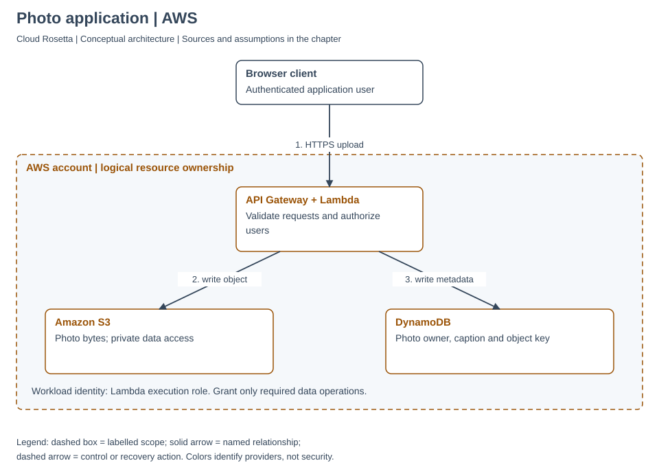

API Gateway invokes Lambda; the Lambda execution role grants the required S3 and DynamoDB
operations. Configure the API's authentication/authorization and object-access controls.
Do not place these regional managed service boxes inside a VPC unless a selected integration
actually requires it.
[API Gateway integration](https://docs.aws.amazon.com/lambda/latest/dg/services-apigateway.html),
[Lambda execution role](https://docs.aws.amazon.com/lambda/latest/dg/lambda-intro-execution-role.html),
[S3](https://docs.aws.amazon.com/AmazonS3/latest/userguide/Welcome.html),
[DynamoDB](https://docs.aws.amazon.com/amazondynamodb/latest/developerguide/Introduction.html).

### Azure

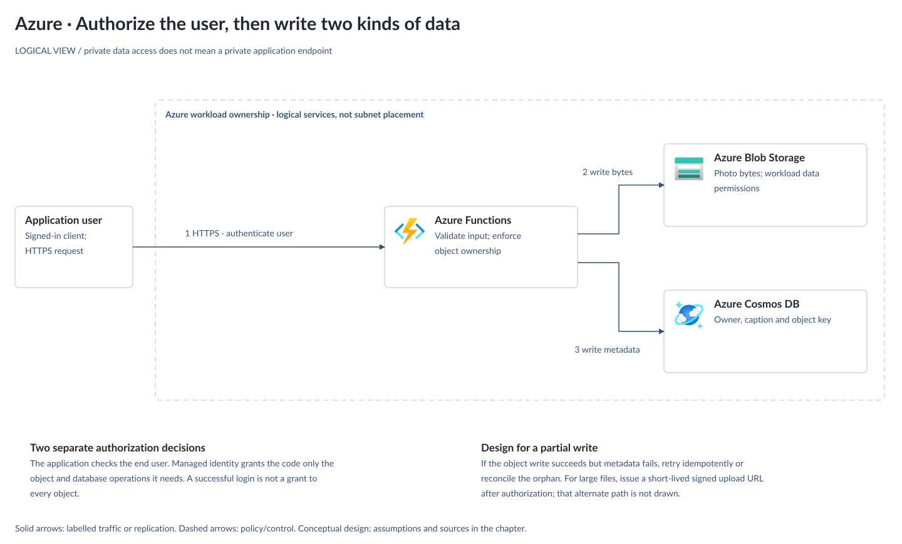

An HTTP-triggered Function is the application endpoint. A managed identity can access Blob
Storage and a supported Cosmos DB API using appropriate data-plane roles. Choose a Functions
hosting plan and configure end-user authentication; a function access key alone is not a user
identity or ownership check. The logical subscription boundary is not a VNet boundary.
[HTTP functions](https://learn.microsoft.com/en-us/azure/azure-functions/functions-bindings-http-webhook-trigger),
[Functions identity](https://learn.microsoft.com/en-us/azure/app-service/overview-managed-identity),
[Blob authorization](https://learn.microsoft.com/en-us/azure/storage/blobs/authorize-access-azure-active-directory),
[Cosmos DB data roles](https://learn.microsoft.com/en-us/azure/cosmos-db/how-to-connect-role-based-access-control).

### Google Cloud

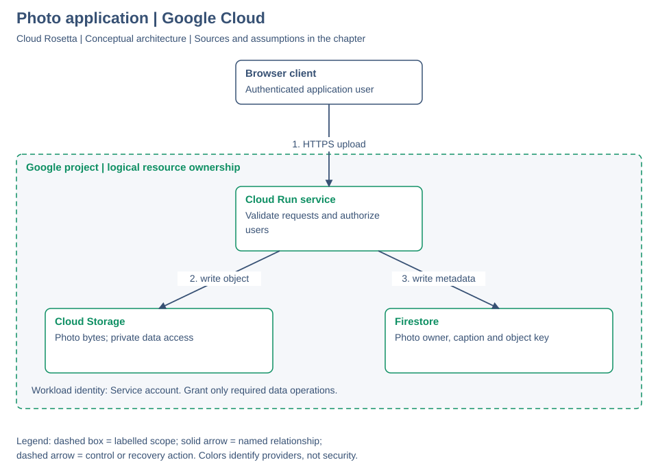

Cloud Run executes the application with a service account. Grant that account the required
Cloud Storage and Firestore permissions. Define who may invoke the service and how the
application identifies and authorizes its users. The drawing does not imply that the managed
services live inside a consumer VPC.
[Cloud Run service identity](https://docs.cloud.google.com/run/docs/securing/service-identity),
[Cloud Storage access](https://docs.cloud.google.com/storage/docs/access-control/iam),
[Firestore server access](https://docs.cloud.google.com/firestore/docs/security/iam).

## Resource Ownership and Network Geography

Arrows represent administrative parentage. AWS OUs and Google folders are optional; the Azure
view is within one directory and includes optional intermediate management groups. This does
not draw the separate identity or billing associations. Resource groups cover resource-group
scope, not every Azure resource type.
[Resource models and sources](01-mental-models.md).

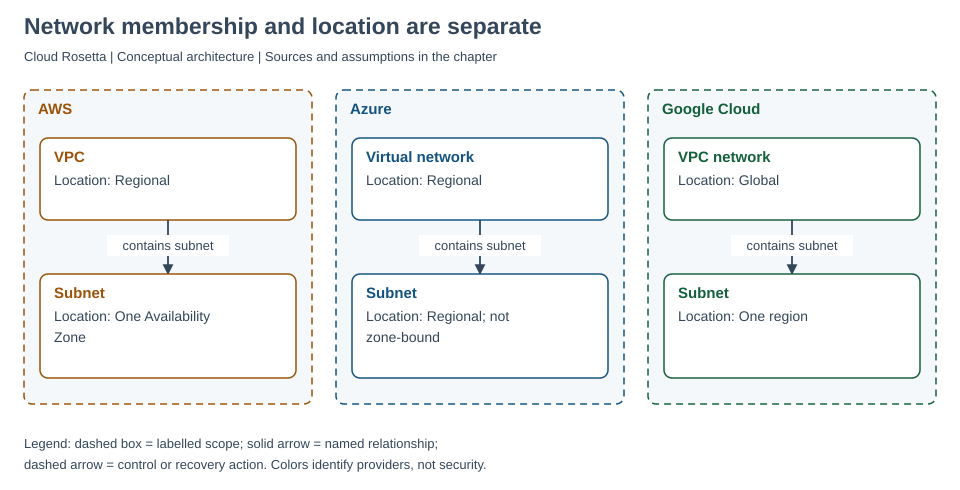

A subnet belongs to a virtual network but has its own location rule. AWS subnets are zonal;
Azure and Google subnets are regional. A global Google network does not make a regional VM or
database global. [Scope sources](01-mental-models.md).

## Identity and Permission Decisions

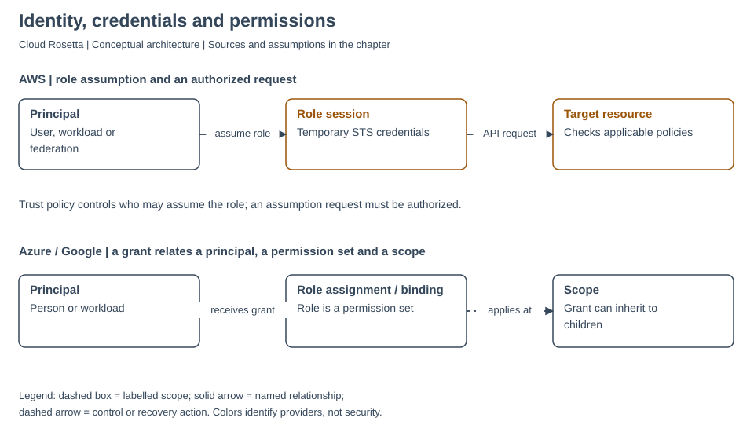

The first row shows successful AWS role assumption followed by a resource request. The
second shows a principal receiving a role at a scope in Azure or Google. Inherited grants
remain subject to applicable conditions and deny controls.
[Identity explanation and sources](02-identity.md).

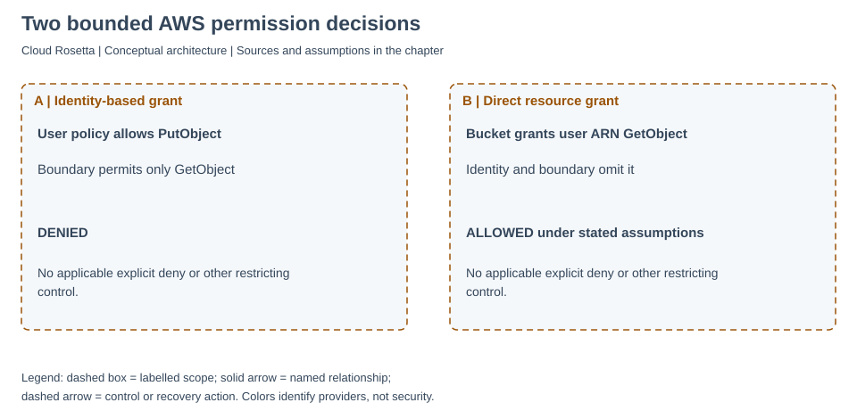

In A, an identity grant cannot exceed the permissions boundary. In B, a same-account bucket
policy directly names an IAM user; identity/boundary omissions alone do not block that grant.
Assume no explicit deny or other restriction. Changing the principal type or account relationship
changes the evaluation. [AWS boundaries](https://docs.aws.amazon.com/IAM/latest/UserGuide/access_policies_boundaries.html).

## Firewall Placement and Private Access

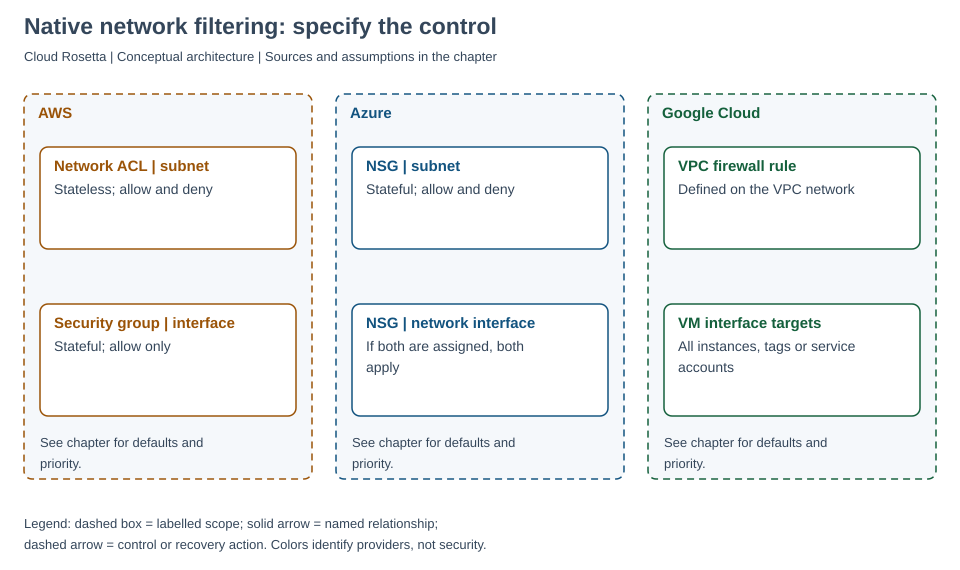

The view compares native controls, not all available firewall products. Azure traffic must
pass both NSGs when both subnet and interface NSGs apply. Google selectors apply rules to
VM interfaces. [Networking details and sources](03-networking.md).

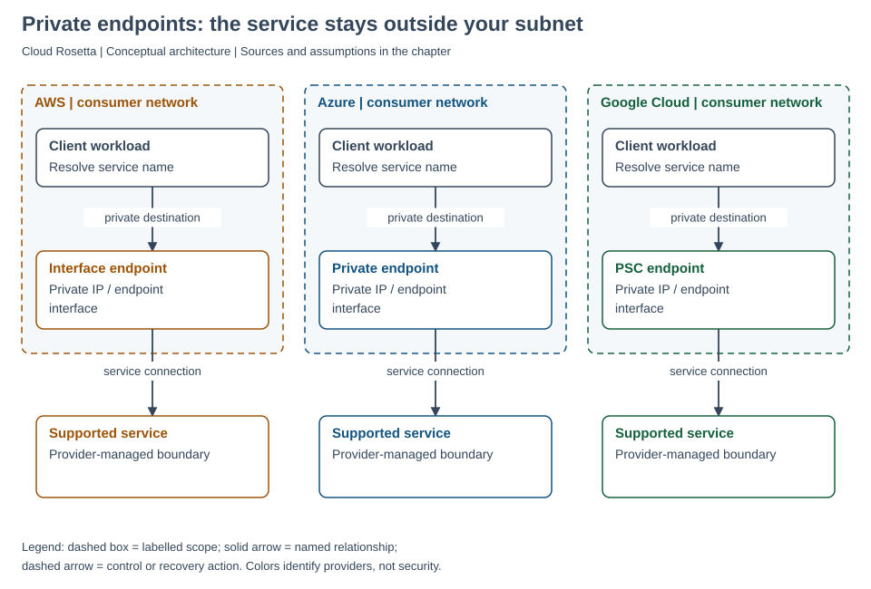

The endpoint is in the consumer network; the supported managed service is outside it.
Hybrid access additionally requires DNS and routing. Private connectivity neither grants
data permissions nor universally disables public access.
[Endpoint details and sources](03-networking.md).

## Database Replication and Recovery

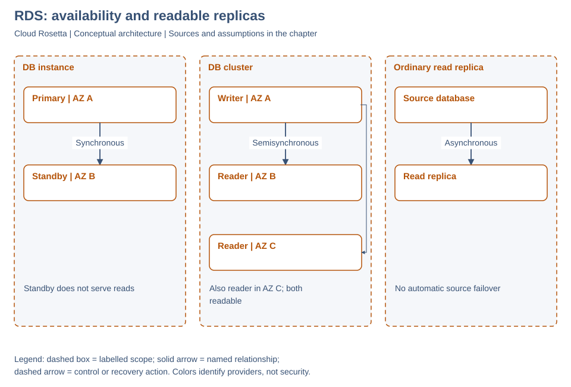

The DB instance pattern has an unreadable standby. The DB cluster has two readable failover
targets and semisynchronous replication; it is distinct from Aurora. An ordinary read replica
is not automatic source failover. Engine, version, region and replica lag matter.
[RDS DB clusters](https://docs.aws.amazon.com/AmazonRDS/latest/UserGuide/multi-az-db-clusters-concepts.html),
[RDS DB instances](https://docs.aws.amazon.com/AmazonRDS/latest/UserGuide/Concepts.MultiAZSingleStandby.html),
[RDS replicas](https://docs.aws.amazon.com/AmazonRDS/latest/UserGuide/USER_ReadRepl.html).

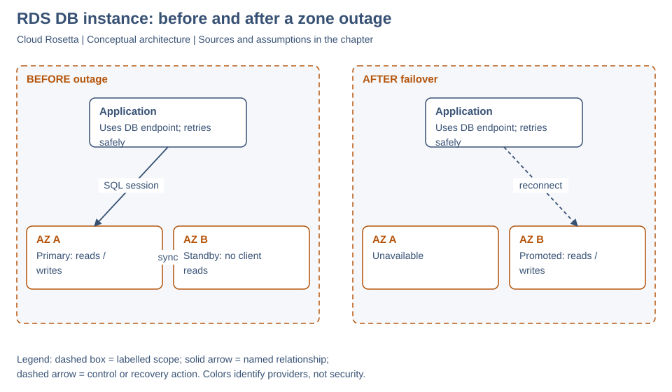

This example is specifically an RDS Multi-AZ DB instance. Promotion and DNS changes do not
preserve existing database sessions; applications need reconnection and safe retry behavior.
The same-region standby is not a complete response to a regional outage or accidental deletion.
[RDS failover](https://docs.aws.amazon.com/AmazonRDS/latest/UserGuide/Concepts.MultiAZ.Failover.html).

## Shared Responsibility

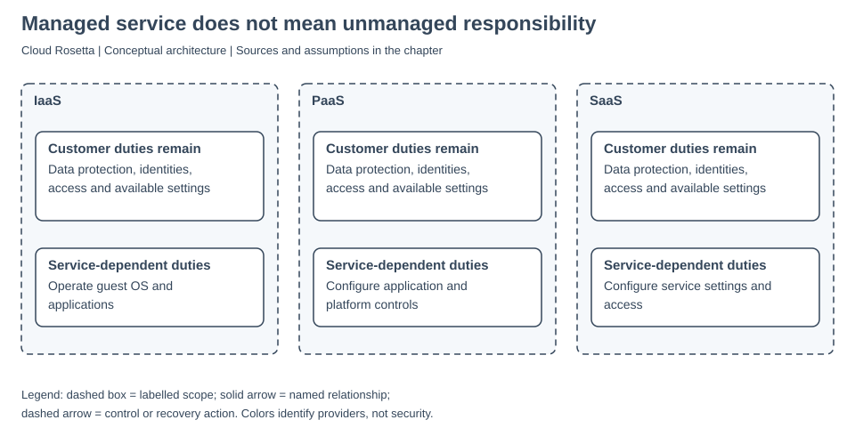

Customers retain data and access responsibilities even with SaaS. This is a responsibility
summary, not a network diagram or an exhaustive contract matrix.
[Foundations and sources](00-landscape.md).

## Before Using a Drawing for a Real System

Document the selected regions, service tiers, traffic volumes, trust model, RTO/RPO, backup
retention and tested failure modes. Add monitoring, deployment and rollback behavior, cost
estimates and operational ownership. Validate supported integrations against current provider
documentation rather than inferring them from two boxes connected by a line.

**Next:** [practice](practice.md) · [chapter index](README.md).

<!-- This document follows common-doc-guidelines.md. -->
