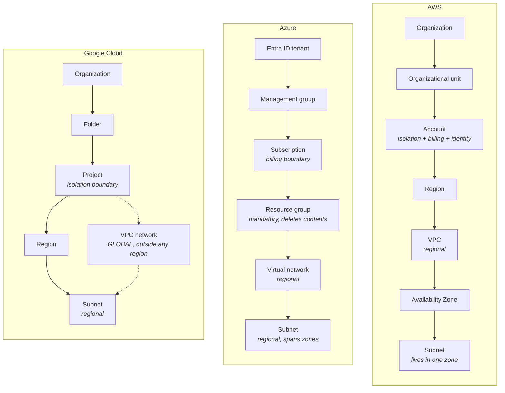

# Hierarchy Diagram

Generated. GitHub renders this natively.

```mermaid
flowchart TB
  subgraph AWS
    direction TB
    A1[Organization] --> A2[Organizational unit]
    A2 --> A3["Account<br/><i>isolation + billing + identity</i>"]
    A3 --> A4[Region]
    A4 --> A5["VPC<br/><i>regional</i>"]
    A5 --> A6[Availability Zone]
    A6 --> A7["Subnet<br/><i>lives in one zone</i>"]
  end
  subgraph Azure
    direction TB
    B1[Entra ID tenant] --> B2[Management group]
    B2 --> B3["Subscription<br/><i>billing boundary</i>"]
    B3 --> B4["Resource group<br/><i>mandatory, deletes contents</i>"]
    B4 --> B5["Virtual network<br/><i>regional</i>"]
    B5 --> B6["Subnet<br/><i>regional, spans zones</i>"]
  end
  subgraph GoogleCloud["Google Cloud"]
    direction TB
    C1[Organization] --> C2[Folder]
    C2 --> C3["Project<br/><i>isolation boundary</i>"]
    C3 --> C4[Region]
    C4 --> C5["Subnet<br/><i>regional</i>"]
    C3 -.-> C6["VPC network<br/><i>GLOBAL, outside any region</i>"]
    C6 -.-> C5
  end
```
