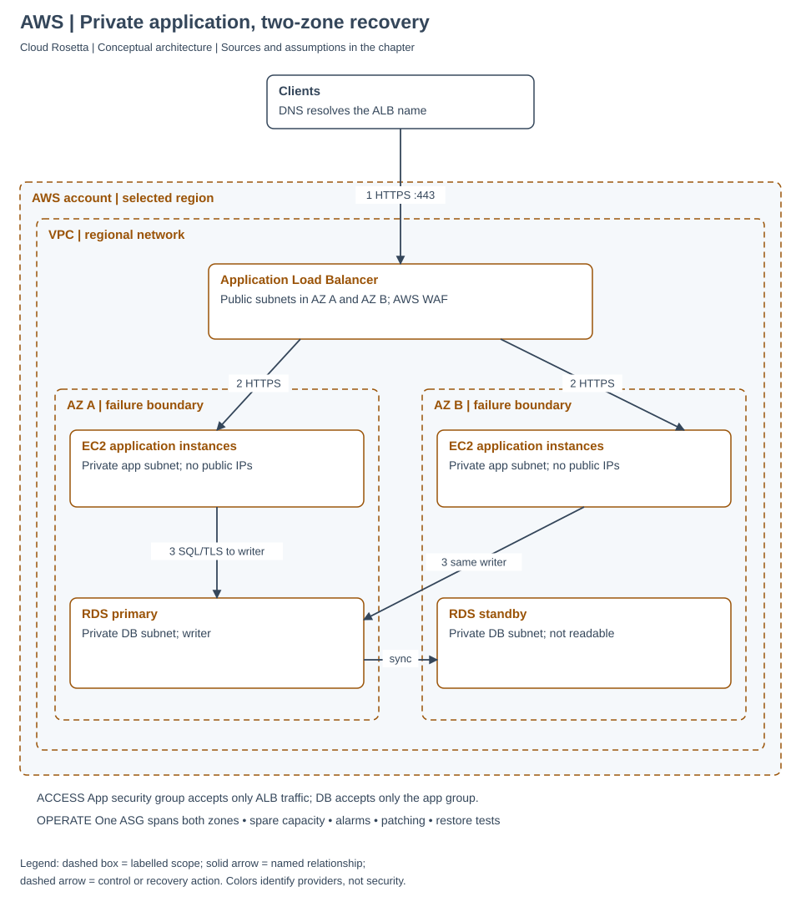
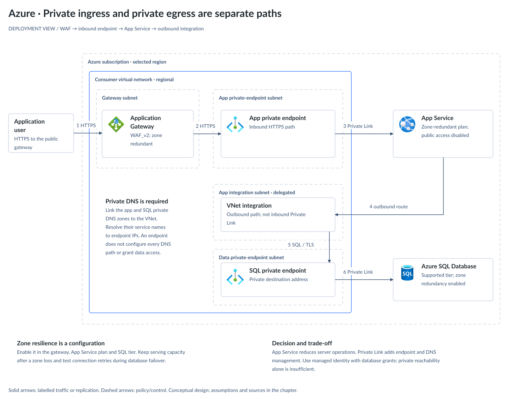
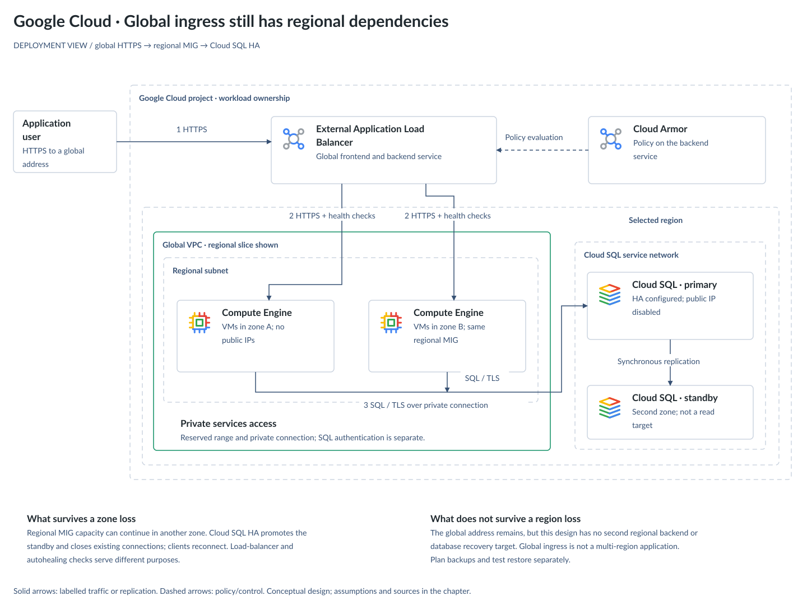

# Design a Resilient Web Application

A service comparison helps you find names. An architecture explains how requests reach your
application, who can access its data, and what happens when a component fails. These three
reference designs serve the same requirement: an internet-facing application with private
application/data access and resilience to a zone failure within one region.

Start with the [simpler photo applications](architecture.md) if you are learning cloud basics.
Use these deployment views when network placement and recovery become requirements. They are
illustrative designs, not tested deployments or a promise of an availability target.
Groups labelled “resources in” or “VMs in” a zone identify the depicted resources
that share a failure location. A VPC or subnet does not own an availability zone.

## Choose the Operating Model First

| Requirement | Design shown | What your team owns |
| --- | --- | --- |
| Control the operating system and application runtime on AWS | EC2 Auto Scaling, ALB, RDS Multi-AZ DB instance | Images, patching, scaling policies, application and recovery testing |
| Deploy a supported web runtime with less server management on Azure | App Service, Application Gateway, Azure SQL Database | Application, plan sizing, private integrations, database permissions and recovery |
| Run a VM-based application behind global HTTP ingress on Google Cloud | Regional managed instance group, global Application Load Balancer, Cloud SQL HA | Images, patching, group policies, firewall rules and recovery testing |

These are design choices, not claims that a cloud only supports that operating model. AWS and
Google also offer managed application runtimes; Azure also offers VM scale sets. Start with
the simplest service that meets the workload's constraints, then add infrastructure for a
specific requirement. Compare [managed and self-managed responsibilities](00-landscape.md).

## AWS: Private Compute Across Two Zones

1. DNS resolves the public ALB address; clients connect with HTTPS. Associate a WAF policy with
   the ALB and configure its TLS certificate. DNS is name resolution, not an inline traffic hop.
2. The ALB forwards requests to healthy EC2 targets. Use public ALB subnets in two zones and
   private application subnets. One Auto Scaling group spans the zones; the diagram's boxes
   represent pools, not a requirement for exactly two instances.
3. Both application pools connect to the same RDS writer endpoint using encrypted database
   connections. This example selects a **Multi-AZ DB instance** with a non-readable standby.
   The synchronous replication arrow is provider-managed, not application dual-writing.

Allow only the application's port from the ALB security group to the application group, and
only the database port from the application group to the database group. Also permit required
health checks. Use workload roles for AWS API access. Database authentication remains a
separate choice; a VM's IAM role alone does not grant SQL permissions. Define outbound routes
and endpoints for updates and dependencies; those paths are omitted from this request view.

**Failure behavior:** health checks remove unhealthy targets; the application must reconnect
when RDS fails over. Keep enough capacity in the surviving zone rather than assuming new
capacity appears immediately. A same-region standby does not protect against every data error
or regional outage.

Sources: [ALB subnet and zone requirements](https://docs.aws.amazon.com/elasticloadbalancing/latest/application/application-load-balancers.html),
[load-balancer routing](https://docs.aws.amazon.com/elasticloadbalancing/latest/userguide/how-elastic-load-balancing-works.html),
[RDS instance replication](https://docs.aws.amazon.com/AmazonRDS/latest/UserGuide/Concepts.MultiAZSingleStandby.html),
[RDS failover and DNS](https://docs.aws.amazon.com/AmazonRDS/latest/UserGuide/Concepts.MultiAZ.Failover.html).

## Azure: Two Different Private Paths

1. Clients reach the public Application Gateway over HTTPS.
2. The zone-redundant WAF_v2 gateway evaluates traffic and uses private DNS to resolve its backend.
3. An App Service private endpoint provides the inbound path to the web app. Disable App Service
   public access explicitly.
4. App Service uses a **different, delegated integration subnet** for outbound connections.
5. Private DNS resolves the SQL hostname to a SQL private endpoint.
6. Private Link connects that endpoint to Azure SQL Database. Disable the SQL public endpoint
   and configure database permissions for the application's managed identity.

This drawing separates app and SQL private endpoints into two subnets for clarity and policy
control. Microsoft’s baseline shares a private-endpoint subnet; splitting it is a design choice,
not a Private Link requirement. The delegated integration and gateway subnets remain separate.

Choose supported App Service and SQL tiers, explicitly enable zone redundancy, and size for
surviving capacity. The managed application and database are drawn outside the consumer VNet;
private endpoints do not move these services into your subnet. The design omits Key Vault,
logging paths and administrative access for readability; define them before implementation.

**Failure behavior:** zone redundancy must exist in every required tier. Application retries
must tolerate interrupted database connections. The inbound private endpoint cannot replace
outbound VNet integration.

Sources: [Microsoft's App Service baseline and network flows](https://learn.microsoft.com/en-us/azure/architecture/web-apps/app-service/architectures/baseline-zone-redundant),
[Azure SQL availability and tier support](https://learn.microsoft.com/en-us/azure/azure-sql/database/high-availability-sla-local-zone-redundancy?view=azuresql).

## Google Cloud: Global Front Door, Regional Dependencies

1. Clients reach the global external Application Load Balancer over HTTPS. Attach a Cloud Armor
   policy to the appropriate backend service.
2. A regional managed instance group distributes application VMs across selected zones.
   Its subnet is regional even though the VPC network is global. Configure firewall rules
   for the selected load-balancer proxy and health-check sources; do not expose VM public IPs.
3. Application VMs use the database's private address with encrypted connections and database
   authentication. Workload service accounts govern permitted Google API calls separately.
4. This design chooses **private services access**: allocate an address range and establish the
   private connection used by Cloud SQL. Cloud SQL remains outside the consumer VPC. Private
   Service Connect is a different option and is not the path illustrated here.

Choose a Cloud SQL HA configuration in the same region, disable its public IP and configure
backups and point-in-time recovery. Separate application health checks, load-balancer health
checks and autohealing decisions so a slow dependency does not trigger needless replacement.

**Failure behavior:** reserve capacity across the selected zones and reconnect after database
failover. A global load-balancer address does not make the regional VM group or Cloud SQL
instance survive a regional outage. Cloud SQL's HA standby is not a read-scaling endpoint.

Sources: [regional instance groups](https://docs.cloud.google.com/compute/docs/instance-groups/distributing-instances-with-regional-instance-groups),
[Cloud Armor and firewall integration](https://docs.cloud.google.com/armor/docs/integrating-cloud-armor),
[global web-service ingress](https://docs.cloud.google.com/compute/docs/tutorials/globally-autoscaling-a-web-service-on-compute-engine),
[Cloud SQL private IP connections](https://docs.cloud.google.com/sql/docs/mysql/private-ip),
[Cloud SQL HA behavior](https://docs.cloud.google.com/sql/docs/mysql/high-availability).

## Turn the Drawing Into an Operational Design

The following are review questions for all three designs. The team must choose and test the
answers for its workload; the boxes alone do not supply them.

| Concern | Decision to record | Evidence to collect |
| --- | --- | --- |
| User access | Authentication method, tenant and object-level authorization | One user cannot read or change another user's objects |
| Network access | Public entry points, private DNS, necessary egress and admin paths | App and database cannot be reached through unintended public paths |
| Availability | Minimum capacity after a zone failure, dependency behavior | Load test while a zone's application capacity is unavailable |
| Recovery time (RTO) | Maximum acceptable time to restore service | Measured failover and restore exercises, including DNS and reconnect time |
| Recovery point (RPO) | Maximum acceptable amount of lost data, measured in time | Restore to a chosen point and reconcile missing or duplicate writes |
| Data protection | Retention, encryption, deletion protection and restore permissions | A successful isolated restore; replication alone is insufficient |
| Operations | Service owner, latency/error/saturation alerts, runbook | An alert reaches an owner who can diagnose and recover |
| Changes | Deployment strategy, rollback and database compatibility | Roll back an application change without corrupting stored data |
| Cost | Baseline replicas, data transfer, logs, backups and networking charges | Estimate normal and peak demand using selected regions and tiers |

For regional recovery, design a second-region data strategy, traffic switching and operational
runbook explicitly. Choose the write model and acceptable replication lag before drawing a
second region. More replicas alone do not solve conflicting writes or accidental deletion.

## What Each Design Gives Up

An architecture that lists only what it provides is a brochure. All three vendors publish a
review framework and expect a design to be defensible against it:
[AWS names six pillars](https://docs.aws.amazon.com/wellarchitected/latest/framework/the-pillars-of-the-framework.html)
(operational excellence, security, reliability, performance efficiency, cost optimization and
sustainability), with equivalents from
[Azure](https://learn.microsoft.com/en-us/azure/well-architected/pillars) and
[Google](https://docs.cloud.google.com/architecture/framework).

These three designs share a requirement, so they share their trade-offs. Each line is a
deliberate choice, not an oversight.

| The choice | What it buys | What it costs | Pillars in tension |
| --- | --- | --- | --- |
| Spread compute across zones | Surviving capacity when one zone fails | AWS and Google show two pools for clarity; Azure uses service-managed zone distribution. Size the surviving capacity for the actual load; a third zone does not imply a fixed cost increase | Reliability against cost |
| Private application and data access | Restricts direct public access to the origin and database | DNS, routing and authorization need separate configuration. Internet egress is omitted here; choose endpoints, NAT or a firewall only when dependencies require them | Security against operational complexity |
| One region | Avoids cross-region write coordination and a second application footprint | A regional outage still interrupts service; recovery requires an explicit second-region strategy | Reliability against cost and operational excellence |
| Zone-resilient database | Provider-managed recovery from a supported zonal failure | Replication and additional capacity cost resources; reconnect time remains. The depicted RDS DB-instance and Cloud SQL standbys do not serve reads. Azure behavior depends on the selected SQL tier | Reliability against performance efficiency and cost |
| Health-based backend routing | Directs requests away from failed application instances | In-flight requests may fail. Test all-backends-unhealthy behavior and use safe retries; health checks cannot repair bad application state | Reliability against application complexity |

If a requirement makes one of these unacceptable, change the design rather than the diagram.
Measure the bottleneck before adding replicas or regions. A dependency, failed deployment or
untested restore can dominate recovery even when compute spans several zones.

## Three Things to Explain Back

- Why does a private endpoint still need both DNS and data permissions?
- Which dependency would stop this application if its entire region became unavailable?
- How would you prove that a backup can meet the business's recovery-time target?

A useful answer follows the request through every dependency and names the test that would
prove recovery. Continue with [failure and identity practice](practice.md).

<!-- This document follows common-doc-guidelines.md. -->
