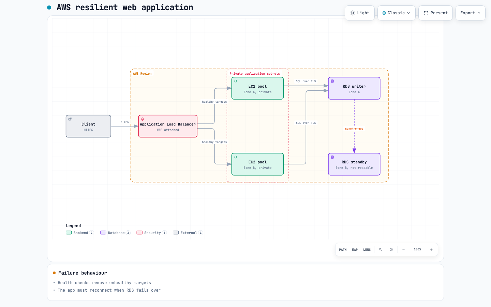

# Archify Evaluation

**Question:** can the [Archify](https://github.com/tt-a1i/archify) skill draw this guide's
architecture diagrams? **Answer:** not the embedded ones. It suits sequence and lifecycle
diagrams, and interactive companions linked from a chapter.

Evaluated 17 September 2026 against Archify 2.17, installed globally with the `archify` skill
only. The maintainer skill `archify-review` was left out because its triggers would fire during
ordinary code review in every project.

## Method

The guide's AWS resilient web application, from
[reference-architectures.md](../reference-architectures.md), was authored as an Archify
architecture specification, validated, delivered, rendered twice, checked in a browser with
Archify's `visual-check`, and inspected in its 1440 by 900 light screenshot. No project file was
changed during the trial.

## The Diagram

> **This drawing is kept as evidence of an error. Do not copy it into the guide.** The
> red "Private application subnets" box spans both zones. An AWS subnet resides in exactly one
> Availability Zone, so the correct design has one private subnet per zone.

Captured by Archify's `visual-check` at 1440 by 900 in the light theme.

| File | Purpose | SHA-256 | Bytes |
| --- | --- | --- | --- |
| [`aws-resilient.architecture.json`](assets/2026-09-17-archify/aws-resilient.architecture.json) | The specification, as evaluated | `006a17a4c6d55eb6…` | 2,913 |
| [`aws-resilient.html`](assets/2026-09-17-archify/aws-resilient.html) | The delivered interactive viewer; download to open it | `9851ba93382ff4df…` | 804,580 |
| [`aws-resilient.png`](assets/2026-09-17-archify/aws-resilient.png) | The screenshot above | — | 80,962 |

The trial files were deleted after the evaluation and rebuilt from the recorded specification for
this record. Because Archify's delivery is deterministic, the rebuilt viewer is byte-identical to
the one evaluated: both hashes above match the original run. GitHub displays the HTML as source
rather than rendering it, which is why the screenshot is included.

These files sit outside the guide and outside `scripts/check_design.py`. Nothing in the build reads
them.

## What Works

| Check | Result |
| --- | --- |
| Validation at `showcase` quality | All 9 artifact checks pass, 0 warnings, after one label repair |
| Determinism | Two deliveries of the same specification are byte-identical |
| External references | None; the output is self-contained |
| Layout | Orthogonal routes, every arrow labelled, no crossings |

Determinism matters most: the output would pass `scripts/check_generated.py`.

## What Conflicts With This Project

| This project requires | Archify produces |
| --- | --- |
| Diagrams embedded inline in the guide page | An 804,580 byte standalone viewer; the drawing is 15,625 bytes, 1.9% of the file |
| Drawings styled by `data/design.yml` | Colour carried by 68 CSS classes and no literal fills, so an extracted drawing loses its styling |
| Lato | JetBrains Mono throughout |
| The palette in `data/design.yml` | 139 colours, 2 of which are project tokens |
| One hue per cloud | Hue per component type: backend green, database purple |
| Official AWS, Azure and Google service icons | A 107-entry logo catalogue with no AWS, no Azure and no individual cloud services |
| Nothing below 14px | `visual-check` reported node text projecting to 6px |
| Named availability zones, VPCs and subnets | Boundary kinds limited to `region` and `security-group` |

## The Accuracy Risk

The last row is the one that affects correctness rather than appearance. With no zone container,
the trial drew the private application subnets as a single box spanning both zones. That is
wrong: an AWS subnet resides in exactly one Availability Zone, which this guide states in
`hier.virtual-network-scope`.

Archify did not force that choice; two boxes could have been drawn. Each would still render, and
appear in the legend, as a security group. A subnet is not a security group, so the drawing would
teach the confusion the guide exists to prevent.

## Decision

**Archify was removed on 17 September 2026 and is not used on this project.** The skill was
uninstalled from every agent it had been installed for, and the setting that disabled its update
check was removed from the shell profile.

The evaluation above recommended keeping `scripts/diagrams.py` for embedded diagrams while using
Archify for sequence and lifecycle diagrams and for interactive companions. That use is not being
taken up. Every diagram comes from `scripts/diagrams.py`.

The diagram and its files above are kept as the record of what was evaluated and why it was not
adopted.

<!-- This document follows common-doc-guidelines.md. -->
